# LAB-1. IBM Cloud Functions. Ознайомлення з IBM Cloud Dashboard

<!-- TOC BEGIN -->
- 1 [Вступ](#p1)

- 2 [IBM Cloud Functions  на IBM Cloud Dashboard](#p2)

- 3 [Создание простой функции из шаблона](#p3)

- 4 [Создание собственной функции](#p4)

- 5 [Выставить функцию, как REST API](#p5)
<!-- TOC END -->

<a name="p1"></a>
## Вступ

В лабораторній роботі ознайомимося с IBM Cloud Dashboard для створення і управління IBM Cloud Functions.

<a name="p2"></a>
## IBM Cloud Functions  на IBM Cloud Dashboard

Якщо зайти в IBM Cloud Dashboard, то IBM Cloud Functions стають зразу доступними. На pic-1  показано, де можно найти їх.

<kbd>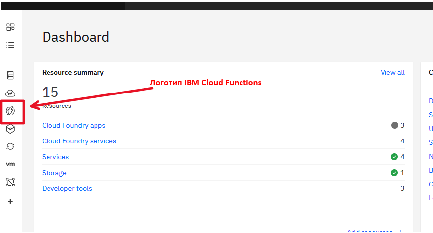</kbd>
<p style="text-align: center;">pic-1</p>                        

В результате натискання на піктограму переходимо в главну консоль IBM Cloud Functions. На pic-2 показані основні елементи управління, що необхідні для створення функцій.

<kbd>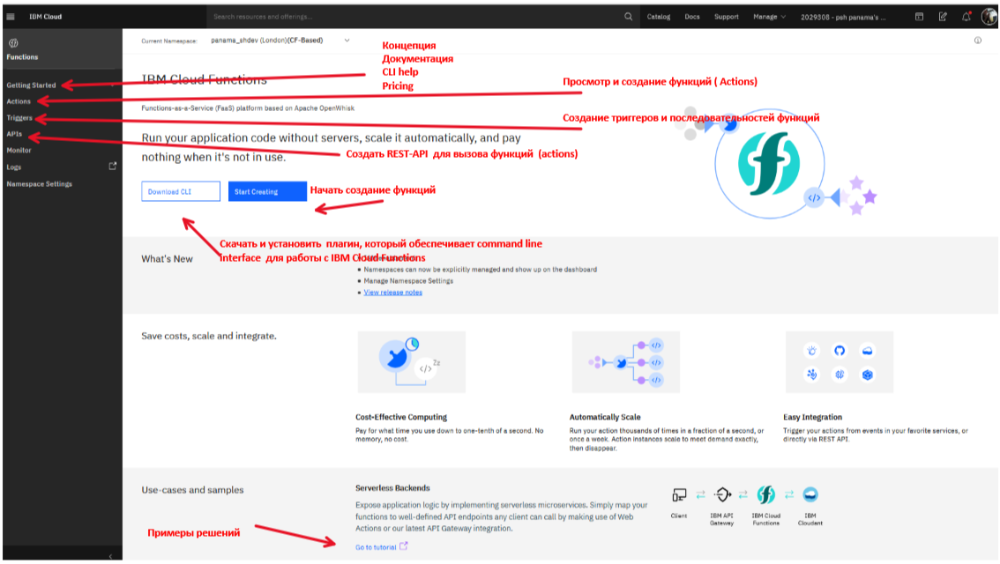</kbd>
<p style="text-align: center;">pic-2</p>


Нажимаємо на кнопку "Start Creating" і попадаємо в главний екран для створення функцій (pic-3).

<kbd>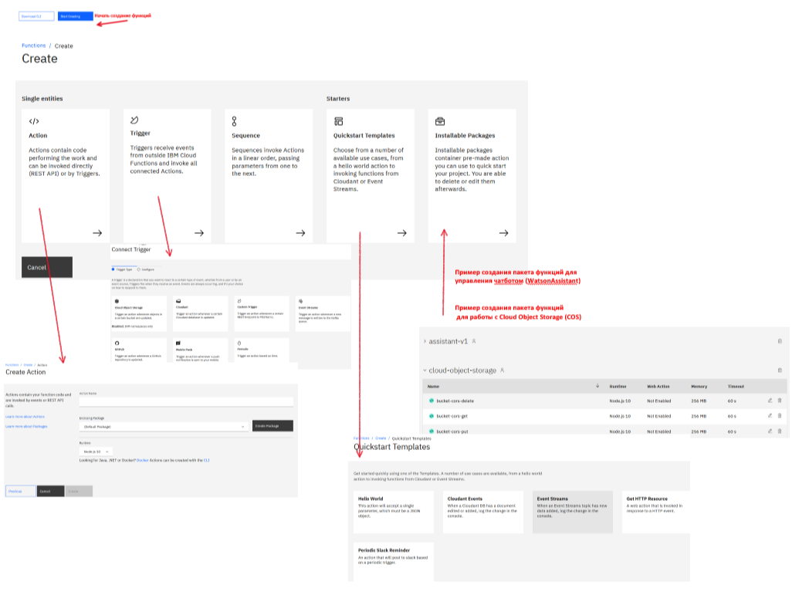</kbd>
<p style="text-align: center;">pic-3</p>

На цьому скриншоті показані всі можливості по сотворенню функцій.

<a name="p3"></a>
## Створення простої функції з уже існуючого шаблона

Для цього поріно знову зайти "Start Creating", вибрати "From Template" и выбираємо "Hello World" (pic-4).

<kbd>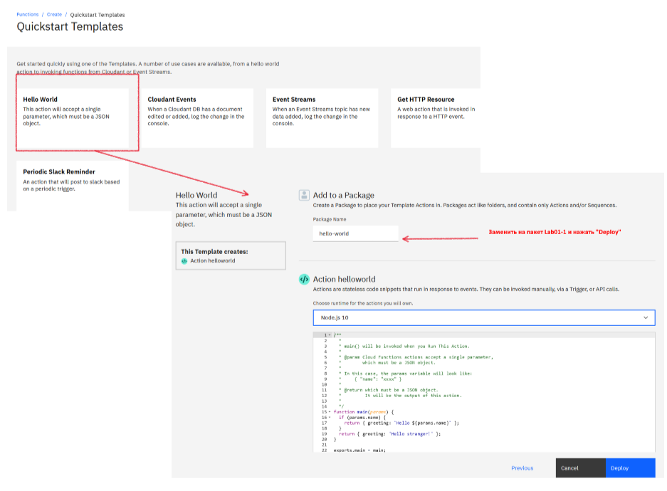</kbd>
<p style="text-align: center;">pic-4</p>

Після успішного створення попадємо у вікно з програмним кодом функции (pic-5).

<kbd>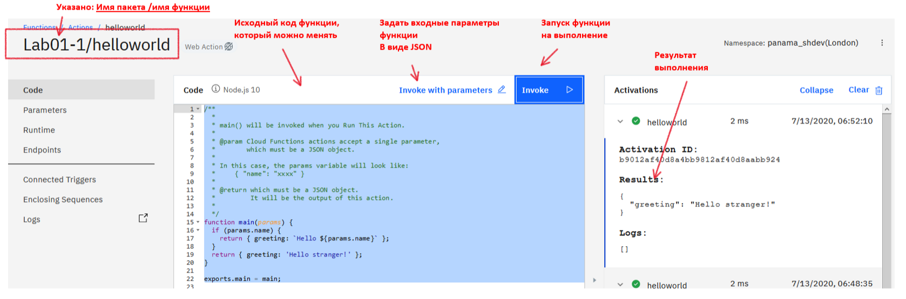</kbd>
<p style="text-align: center;">pic-5</p>

В цьому прикладі, при натисканні на кнопку **"Invoke"**, виконується запуск функції и результаті работи функції побачиом в правій частині вікна. Параметрів у функцію не передавалось, тому зразу побачиом відповідь:

```json
  {
        "greeting": "Hello stranger!"
  }

```
 Тепер по кнопці: **"Invoke with parameters"** задаємо параметри запуску функції. Параметри задаються у вигляді плоского JSON файла. Далі паказано приклад json  параметрів.

```json

{   "name": "Jim",
    "phone": "222-33-44",
    "id": 1234567
}
```

Даніе цього json потрібно вставити у вікно вводу параметрів і повторити запуск функції.

<kbd>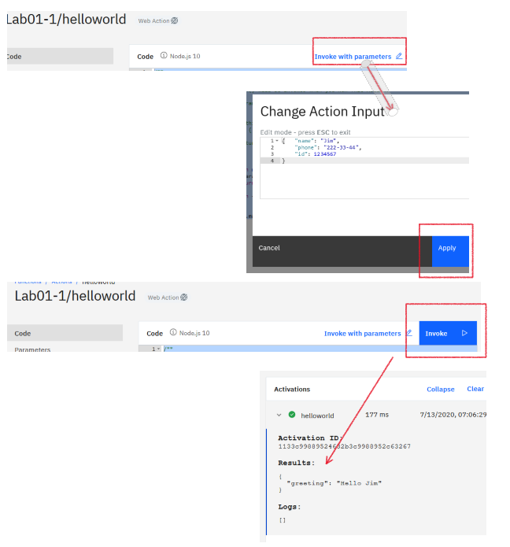</kbd>
<p style="text-align: center;">pic-6</p>

В цьому випадку відповідь уже змінилася, і ми отримали у відповіді **"Hello Jim"**, тобто параметр **"name"** був прочитаний

```json
{
  "greeting": "Hello Jim"
}
```


<a name="p4"></a>
## Створення власної функції

Перейдемо до списку **"Actions"**. Ми бачимо тільки  одну функцию helloworld в пакеті Lab01-1 (pic-7). 
<kbd>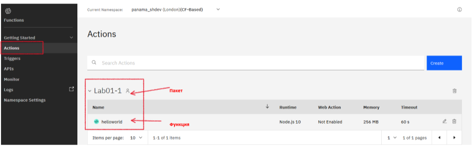</kbd>
<p style="text-align: center;">pic-7</p>

Для створення власної функції потрібно нажати кнопку **"Create"** и вибрати опцію **"Action"**  (pic-8).

<kbd>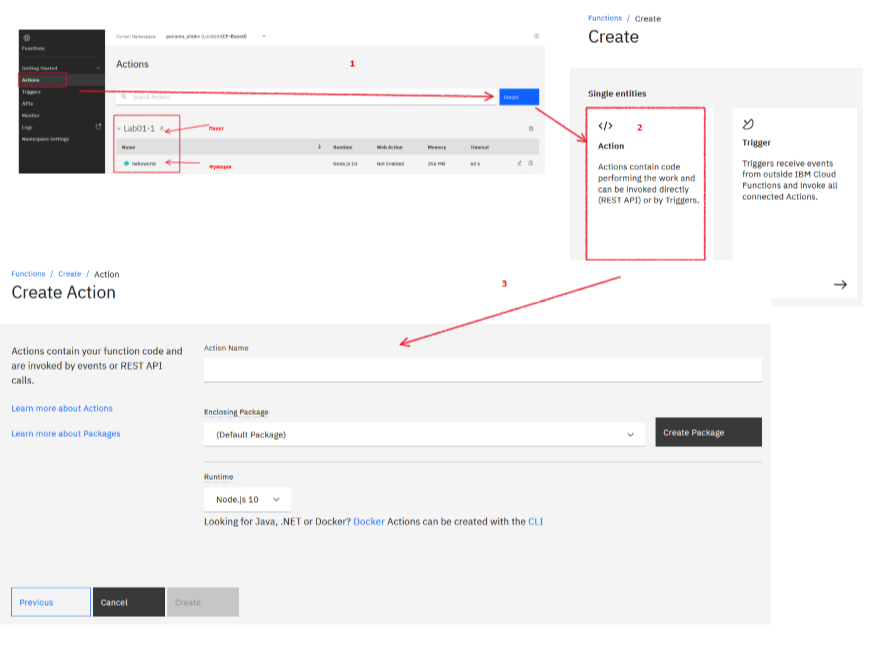</kbd>
<p style="text-align: center;">pic-8</p>

Далі потрібно:

- внести ім'я Action, для прикладу: **"GetCustomerByPhone"**;

- выбрати ім'я існуючого пакету, або створити новий;

- нажати **"Create"**.

На (pic-9)  показане заполнене вікно вводу.
<kbd>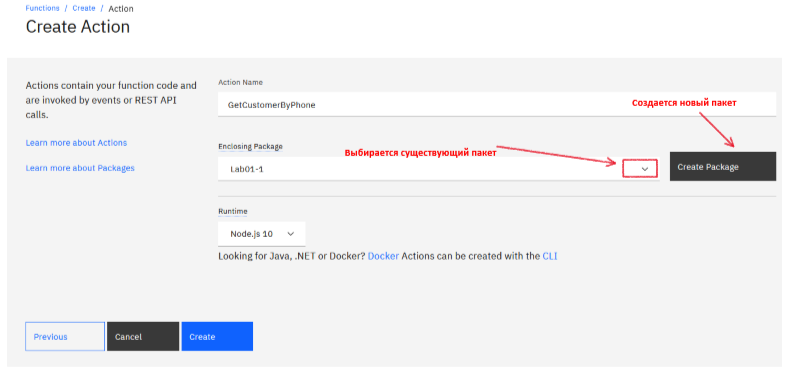</kbd>
<p style="text-align: center;">pic-9</p>

Натискаємо кнопку **"Create"**, отримаємо шаблон для написания свого програмного коду (pic-10).

<kbd>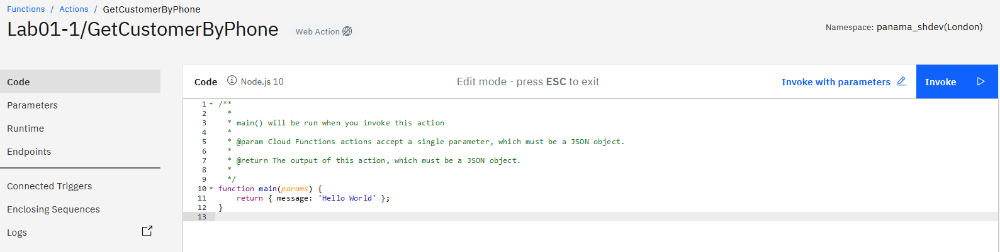</kbd>
<p style="text-align: center;">pic-10</p>

Для написания своєї функції (action), придумаємо абстрактну задачу: Разробити асинхронну функцию, яка по номеру телефона поверні данні клієнта.

На вхід  функція принимає json объект:

```json
    {"phone": "222-33-44"}
```

У випадку успішного виконання, функція поверне json-обьект:

```json
    {
      "cif": "100012340",
      "cif_address": "Kyiv, Khreschatic, 26, flat 123",
      "cif_firstname": "Pavlo",
      "cif_lasname": "Petrenko"
    }
```

В випалку, коли телефон не переданий, функція генерує помилку з повідомленням: *"Не передан параметр params.phone!"*

Програмний код функції знаходиться у файлі: [/LAB-1/GetCustomerByPhone.js](/LAB-1/GetCustomerByPhone.js)
Програмний код необхідно вставити у вікно браузера. В **"Invoke with parameters"**  необхідно вставити json с параметрами запуску
```json
    {"phone": "222-33-44"}
```

 та запустити на виконання по кнопці **"Invoke"**.
 В результаті побачимо екран як на pic-11.

<kbd></kbd>
<p style="text-align: center;">pic-11</p>

Функція працює. Тепер необхідно функцію виставити в якості REST API  для публічного використання.

<a name="p5"></a>
## Виставити функцію, как REST API

Для цього необхідно
- в разділі Endpoints  включити Web Action (pic-12).

<kbd>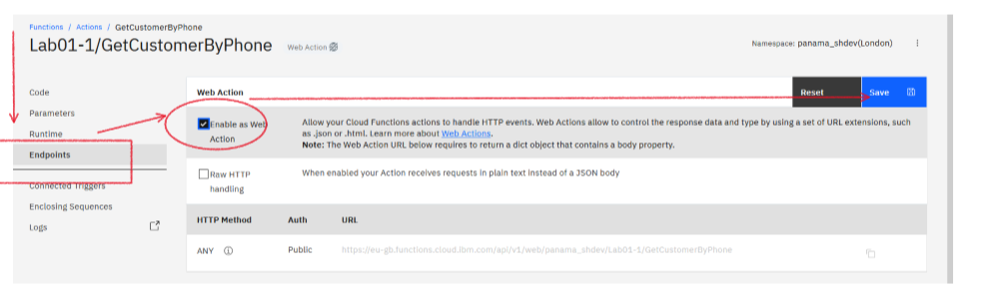</kbd>
<p style="text-align: center;">pic-12</p>

- вернутися в разділ основного меню functions и вибрати розділ API (pic-13).

<kbd>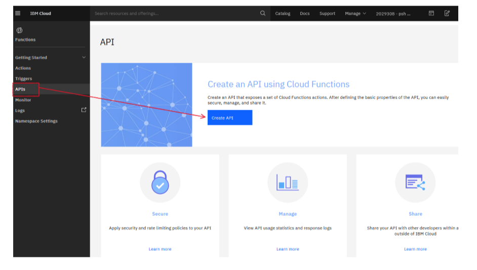</kbd>
<p style="text-align: center;">pic-13</p>

- вводимо найменування API и BaseURL.
<kbd>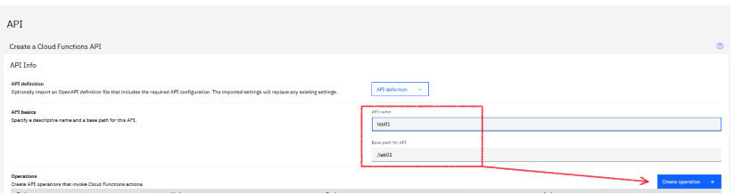</kbd>
<p style="text-align: center;">pic-14</p>

- Встановлюємо http суфікс і http метод.
<kbd>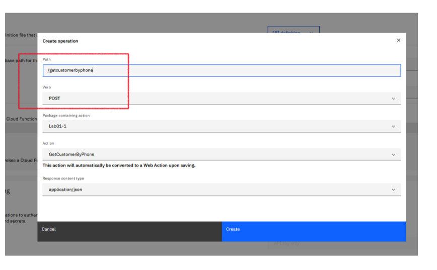</kbd>
<p style="text-align: center;">pic-15</p>

- Авторизацію ми не предбачаємо зараз, тому опускаємося вниз і нажимаємо **"Create"**

В результаті виконання кроків ми отримаємо екран моніторингу та управління API (pic-16).

<kbd>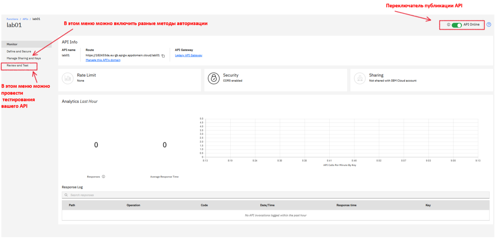</kbd>
<p style="text-align: center;">pic-16</p>

Зходимо в меню **review and test**, вибираємо вкладку **try it**, вводимо параметри запиту та запускаємо на виконання. Результат показано на pic-17.

<kbd>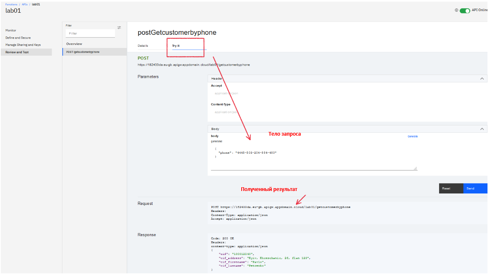</kbd>
<p style="text-align: center;">pic-17</p>
