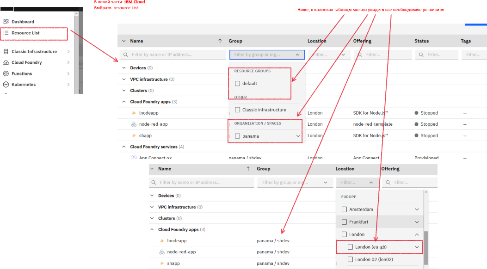
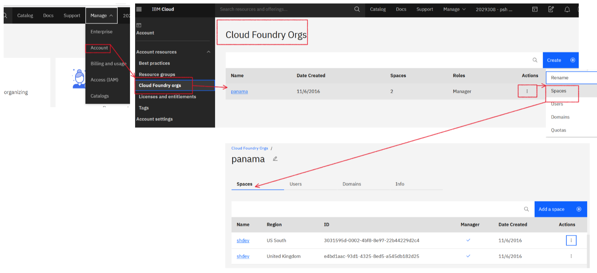
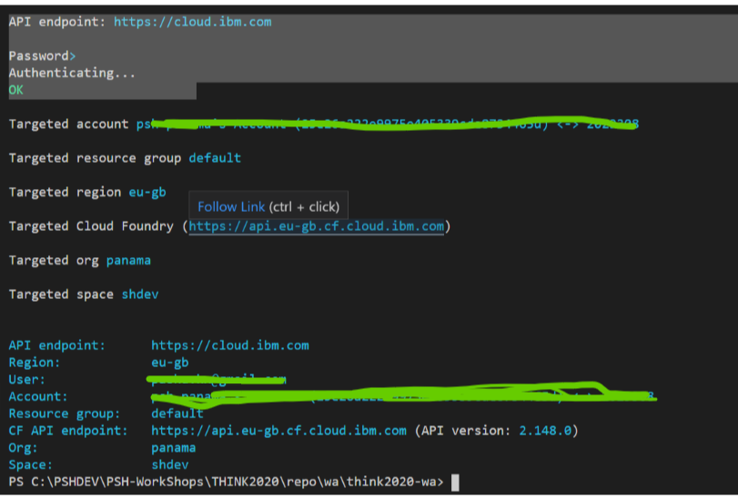
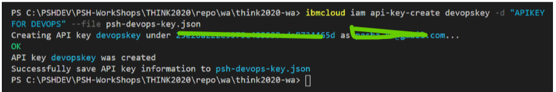
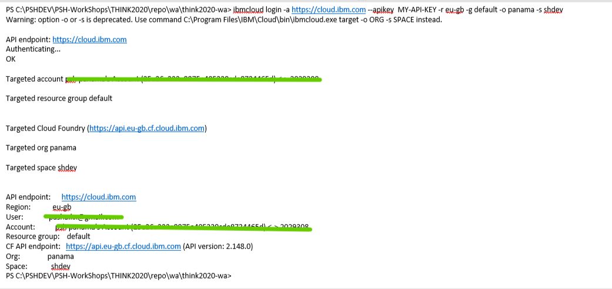
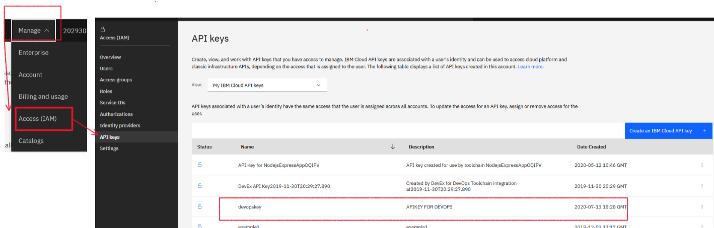
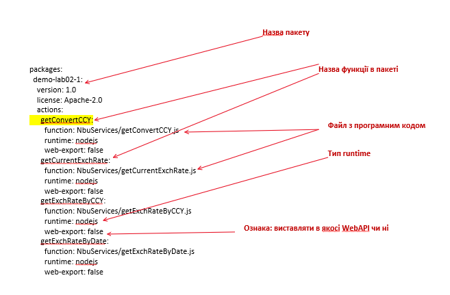

# LAB-02. IBM Cloud Functions. Разробка та deployemnt функцій з використанням інтерфейсу командного рядка

<!-- TOC BEGIN -->
- 1 [Вступ](#p1)

- 2 [Знайомство с IBM CLI](#p2)

- 3 [Разробка функцій, які використовують інші http-сервіси](#p3)

- 4 [Використаня CLI](#p4)


<!-- TOC END -->

<a name="p1"></a>
## Вступ

Ця работа призначена для организації работи разробника с використнням командного рядка IBM CLI.
Для работb будутm dbrjhbcnjdedfnbcz:
- Visual Studio Code (можна інший редактор)
- IBM Cloud CLI
- plugin cloud-function к IBM Cloud CLI

Інструкція по встановленю IBM Cloud CLI и plugin cloud-function доступна по лінку: 
[IBM Cloud fuction setup CLI](https://cloud.ibm.com/functions/learn/cli). 


<a name="p2"></a>
## Знайомство з IBM Cloud CLI

Перше, що портібно зробити -  це виконали логін з допомогою CLI в IBM Cloud

Для цього використовуємо команду: **ibmcloud login**

```bash

ibmcloud login -a <API endpoint> -u <user mail> -p <user password> -r <region> -g <resource group> -o <cloudfoundry organisation> -s <space>

```
* -a API endpoint указывается https://cloud.ibm.com
* -u user mail  вказуємо e-mail  з яким користувач заходить в IBM Cloud dashboard
* -p user password вказуємо пароль користувача, с яким він заходить в IBM Cloud dashboard 
* -r region вказуємо регіон, в якому будуть разгортатися ваші сервіси
* -g resource group вказуємо группу ресурсів (якщо вона є). За замовчуванням має назву default. Можна пропустити, не обов'язковий
* -o cloudfoundry organisation 
* -s space in cloudfoundry organisation

Реквізити: region, resource group, cloudfoundry organisation, space можна отримати из таблиці відображення ресурсів (pic-1)
<kbd></kbd>
<p style="text-align: center;">pic-1</p>

Або, зайти у свій  account в меню: "Manage/Account/Cloud Foundry Orgs" (pic-2)

<kbd></kbd>
<p style="text-align: center;">pic-2</p>


Приклад команди:

```bash

 ibmcloud login -a https://cloud.ibm.com -u zzzz@gmail.com -r eu-gb -g default -o panama -s shdev

```
Результат роботи команди показантй на pic-3
<kbd></kbd>
<p style="text-align: center;">pic-3</p>

Вводити персональний логін та пароль кажен раз не комфортно. Більш того, це не  краще рішення для виконання автоматизированих devops операцій. Тому, є можливість зайти в CLI і з допомогою згенерированого [API-KEY](https://cloud.ibm.com/docs/cli?topic=cli-ibmcloud_commands_iam).

```bash
ibmcloud iam api-key-create NAME [-d DESCRIPTION] [--file FILE] [--lock] 
```

* NAME (required)
    Найменування API key, який буде створений.
* -d DESCRIPTION (опціонально)
    Опис API-KEY.
* --file FILE
    Зберегти інформацію про API key у заданый файл на laptop.
* --lock
    Заблокувати API key.

Приклади:
Create an API key and save to a file:

```bash
ibmcloud iam api-key-create MyKey -d "this is my API key" --file key_file
```
Файл **key_file** являє собой JSON.

Таким яином створений API-KEY  в локальный файл и будем его исопльзовать в дальнейших операциях. Генерируем, выконавши  команду:

```bash
ibmcloud iam api-key-create devopskey -d "APIKEY FOR DEVOPS" --file psh-devops-key.json 

```

Результат виконання команди показано на pic-4 та у файлі **psh-devops-key.json**

<kbd></kbd>
<p style="text-align: center;">pic-4</p>

Теперь модифікуємо команду логін для використанняя в ній API-KEY.
API  вибираєтся з отриманого JSON-файла, поле: **"apikey"**

```bash
 ibmcloud login -a https://cloud.ibm.com --apikey yourApiKey -r eu-gb -g default -o panama -s shdev
```

Результат роботи команди показано на pic-5.

<kbd></kbd>
<p style="text-align: center;">pic-5</p>

Список створених API-KEYs можна побачити у своєму account, по шляху: Manage/Access IAM/API keys.
<kbd></kbd>
<p style="text-align: center;">pic-6</p>


<a name="p3"></a>
## Разробка функцій, які використовують інші http-сервіси


В якості тестового прикладу розробимо пакет функцій які образается до відкритих сервісів Національного банку України для отримання курсів валют.


Так, на сторінці [API для розробників] (https://bank.gov.ua/ua/open-data/api-dev) присутній опис сервісу для отримання курсів валют НБУ:

```text

    Офіційний курс гривні до іноземних валют та банківських металів
    Курс на поточну дату 		
    Курс на дату (формат файлу Статзвітності #99), дата задається у форматі: ddmmyyyy, де dd - день, mm - місяць, yyyy - рік 		
    Курс на дату, дата задається у форматі: yyyymmdd, де yyyy - рік, mm - місяць, dd - день 		
    Курс на дату по валюті (код валюти літерний, регістр значення не має) 		

    Примітка: Поточного дня буде відображатися офіційний курс гривні до іноземних валют, встановлений НА ЗАВТРА за схемою:

        До 16:00 – відображається лише офіційний курс гривні до іноземних валют, що встановлюється 1 раз на місяць.
        Після 16:00 - офіційний курс, зазначений у п.1, та офіційний курс гривні до іноземних валют, що встановлюється щодня.

    Інструкція до сервісу отримання курсів гривні до іноземних валют з першоджерела в момент підписання 	
    Довідкове значення курсу гривні до долара США на 12:00, дата задається у форматі yyyymmdd, де yyyy - рік, mm - місяць, dd - день
```


Необхідно розробити набір функцій, які будуть отримувати курси НБУ:

- Поточний курс НБУ по всіх валютах
- Курс НБУ за всіма валютами за вказану дату
- Курс НБУ по вказаній валюті за зазначену дату
- Функцію конвертації суми в одній валюті в суму в іншій валюті за курсом НБУ за задану дату.
Функції необхідно помістити в один пакет, так як логічно вони представляють єдиний сервіс.

Вихідний код функцій нах'одітся в каталозі **. / NbuServices **


* GetCurrentExchRate.js - отримання поточного курсу валют по всім валютам;
* GetExchRateByDate.js - отримання курсу по всіх валютах за задану дату;
* GetExchRateByCCY.js - отримання курсу по вказаній валюті за вказану дату;
* GetConvertCCY.js - конвертація валют по курсу НБУ.

<a name="p4"></a>
## Використаня CLI 

Розробка функцій сперщу ведеться локально з використанням стандартних інструменів тестування.

Таким чином, в корені проекту лежить стандартний package.json з установденими потрібним пакетами для забезпечення пакетів тестування та потрібних залежностей:

```json

{
  "name": "Lab-02",
  "version": "1.0.0",
  "description": "**Lab-02 **",
  "main": "./func/f3.js",
  "scripts": {
    "test": "echo \"Error: no test specified\" && exit 1"
  },
  "repository": {
    "type": "",
    "url": ""
  },
  "author": "",
  "license": "ISC",
  "dependencies": {
    "axios": "^0.19.2",
    "chai": "^4.2.0",
    "mocha": "^8.0.1",
    "needle": "^2.5.0",
    "querystring": "^0.2.0",
    "supertest": "^4.0.2"
  }
}


```

В каталозі **test**   знаходяться тестові кайси для функцій, що запускаються локально

В каталозі  **NbuServices**  знаходиться  програмний код функцій

В каталозі params знаходяться  json файли з параметрами функцій, що передаються на вхід.

В корені проекту знаходиться **yml** файл, що описує  деплоймент пакету в хмару з допомогою CLI.

```yaml
packages:
  demo-lab02-1:
    version: 1.0
    license: Apache-2.0
    actions:
      getConvertCCY:
        function: NbuServices/getConvertCCY.js
        runtime: nodejs
        web-export: false
      getCurrentExchRate:
        function: NbuServices/getCurrentExchRate.js
        runtime: nodejs
        web-export: false
      getExchRateByCCY:
        function: NbuServices/getExchRateByCCY.js
        runtime: nodejs
        web-export: false
      getExchRateByDate:
        function: NbuServices/getExchRateByDate.js
        runtime: nodejs
        web-export: false

```

Призначення компонентів файлу показані на малюнку 
<kbd></kbd>
<p style="text-align: center;">pic-6</p>

Якщо вже виконали команду 

```bash
   ibmcloud login
```

то deployment виконується дуже просто:

```bash
 ibmcloud fn deploy --manifest demo-lab02-1.yml


```

Переглянути список пакетів та функцій можна ,відповідно, командами

```bash
 ibmcloud fn package list
 ibmcloud fn action list
```

Запустити на виконання окремо взяту функцію можна командою:

```bash
 ibmcloud fn action invoke ACTION_NAME [--blocking] [--param KEY VALUE] [--param-file FILE] [--result]

```

Для прикладу:

Запутить функцію без параметрів і поверне id запуску
```bash
 ibmcloud fn action invoke demo-lab02-1/getCurrentExchRate 
```

По отрманому id можна прочитатит лог виконання функції та отримати результат

```bash
  ## лог виконання
  ibmcloud fn activation logs 914d4c45944342468d4c4594439246b9 
  
  ## результат виконання
  ibmcloud fn activation result db355334a09348c7b55334a09368c70b
```

Результат можна отримати і зразу, запустивши функцію з ключем **--result**

```bash
 ibmcloud fn action invoke demo-lab02-1/getCurrentExchRate --result
```

Типове питання, яке лежить на поверхні: "як у функцію передати парметри"?
Для цього є каталог params  в якому знаходяться json файли з параметрами запуску функцій. ЇХ і викристаємо.

А бо ж можна прямо з командного ряку задати:

```bash
 ibmcloud fn action invoke demo-lab02-1/getCurrentExchRate --param date 2020-06-16 --result
```

Або ж з використанням файлів за параметрами:

```bash
 ibmcloud fn action invoke demo-lab02-1/getCurrentExchRate --param-file ./params/getExchRateByDate.json --result


 ibmcloud fn action invoke demo-lab02-1/getExchRateByCCY --param-file ./params/getExchRateByCCY.json --result

 ibmcloud fn action invoke demo-lab02-1/getConvertCCY --param-file ./params/getConvertCCY.json --result


```

